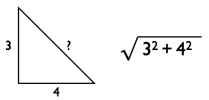
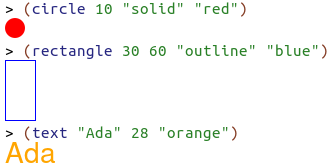
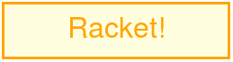
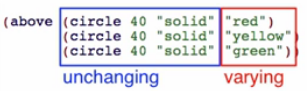
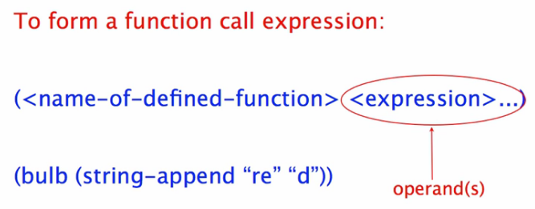
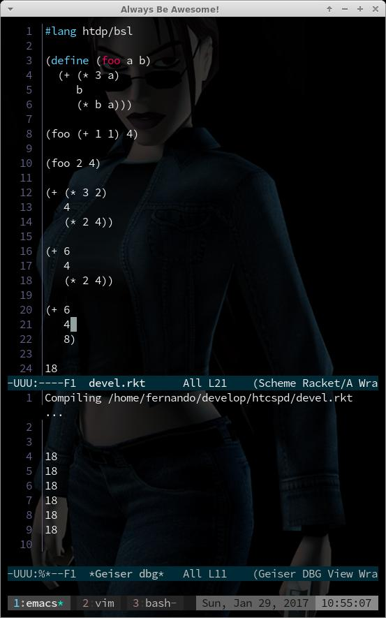

= How To Code - Systematic Program Design - Module 1
:source-highlighter: pygments
:pygments-css: class
:toc: left
:toc-title: Index
:idprefix:
:toclevels: 6
:sectlinks:
:webfonts!:
:icons: font
:figure-caption!:

== Welcome

They ask you to write a program.  You are typically given a poorly formed program. You should write a program to perform a task or solve a problem, but the task or the problem are vague, incomplete, unclear or even inconsistent.

Goal: go from a  poorly formed problem to a well-structured solution. This is Systematic Program Design (= good programmers).

The techniques learned in this course are transferable to other programming languages.

BSL is simple, and has the core features any language is expected to have, so, we don’t rely on features of any specific programming language to program.

== 1a: Beginning Student Language

Learning Goals:

* Be able to write expressions that operate on primitive data including numbers, strings, images and booleans.
* Be able to write constant and function definitions.
* Be able to write out the step-by-step evaluation of simple expressions including function calls.
* Be able to use the stepper to automatically step through the evaluation of an expression.
* Be able to use the Dr Racket (but I learned to do that rom Emacs + Geiser as well) help desk to discover new primitives.

Read about the BSL primitive operations, expressions, evaluation rules and other things here.

All source code for this module can be found in this in gitlab - 01 - beginning student language directory.

=== Expressions
....
(+ 3 4)    ; expression
7          ; value

(- 1 (* 2 3))    ; expression
-5               ; value
....

Expressions are evaluated and a value is produced.

To form an expression:

....
open parens <prim. operat.> <expr1> <expr2> <exprN>... close parens
(<primitive operator> <expr1> <expr2> <exprN>...)
....

Some primitives take a specific number of expressions.

A value can be an expression as well.

Primitive operations on numbers:

....
+    -    *    /    modulo    sqr    sqrt
....

In racket-mode (emacs), `C-c C-d` finds the definition for the operator under the cursor.

....
(sqrt (+ (sqr 3) (sqr 4)))
....

Irrational numbers cannot be written as a/b  where a and b are integers. That means decimal representations are infinitely long (and not repeating like ⅓).

....
(sqrt 2)
#i1.4142135623730951
....

#i means “this is pretty close but not exactly this. #i means “inexact number” (careful: #i doesn’t mean “imaginary number”, it means “inexact number”).

=== Evaluation
How does racket evaluate expressions to produce values?

....
(+ 2 (* 3 4) (- (+ 1 2) 3))
....

`(+ ...)` is a call to a primitive. + is the operator. Expressions that follow the operator are the operands. An expression or a call to a primitive can have nested expressions and nested calls to primitives. In the above:

....
          (+  → is a call to a primitive
           2  → is an operand
     (* 3 4)  → is an operand
 (- (+ 1 2))  → is an operand
           3  → is an operand
....

But some operands themselves can be themselves decomposed into operator and operands. For example, in `(* 3 4)`, `(*` means we have a primitive call, and 3 and 4 are operands.

==== Primitive Call Rule
To evaluate a primitive call:

* first reduce operands to values;
** if the operand is a value already, then just apply the operator.
* then apply primitive operators to the values.

We start from left to right, from inner to outer parentheses. Left to right, inside to outside.

....
(+ 2 (* 3 4) (- (+ 1 2) 3))
(+ 2 12      (- (+ 1 2) 3))
(+ 2 12      (- 3       3))
(+ 2 12      0)
14
....

=== Strings and Images
Evaluation rules for strings and images are the same as for the other primitives we saw in the last section.

==== Strings
Use double quotes to create strings in BSL, ex:  \~"Ada Lovelace"\~h.

....
> (string-append "Ada" "Lovelace")
"AdaLovelace"
> (string-append "Ada" " " "Lovelace")
"Ada Lovelace"

> 42   ; number
42
> "42" ; string
"42"
....

You can add a number to a number, but not to a string (even if the string looks like a number).

....
> (string-length "resumé")
6
> (substring "Racket" 0 2)
"Ra"
....

Strings are zero-based indexed. Beware of the off-by-one error.

==== Images
See http://docs.racket-lang.org/picturing-program/s[Picturing Programs Teachpack] and https://docs.racket-lang.org/teachpack/2htdpimage.html[2htdp/image].

`(require 2htdp/image)` includes image functions from the 2nd edition of the How to Design Programs book.

These functions are also primitives.

Note that the “Ada” in orange above is an image.

image::./imgs/003-imgs.png[scaledwidth=100%]

image::./imgs/004-imgs.png[scaledwidth=100%]

`circle` and `triangle` both return an image, and those images are used by the function above, and it returns a new image, and that is aligned beside the square produced by `square`. It looks like all image functions return an image so one can keep using the result of a function in combination with another. Even functions that just align images return a new image.

Exercise to create image:

[source,scheme,lineos]
----
#lang htdp/bsl
(require 2htdp/image)

(overlay (text "Racket!" 32 "orange")
         (rectangle 248 58 "solid" "lightyellow")
         (rectangle 254 64 "solid" "orange"))
----

Code in https://gitlab.com/fernandobasso/htcspd/blob/master/01a-beginning-student-language/create-image.rkt[gitlab repo].

=== Constant Definitions
Constants make programs easier to read and change. Readability and changeability are two of the most important properties a program can have.

We use constants to give names to values we use in the program.

Defining a constant doesn’t produce a value. If you run .rkt file in which only constant definitions exist, nothing is output. Try that in DrRacket and geiser to see!

....
(define WIDTH 400)
(define HEIGHT 300)
(* WIDTH HEIGHT)
....

The last expression above does produce a value. According to the evaluation rules, first WIDTH becomes 400, then, in the next evaluation step HEIGHT becomes 300, and then the primitive multiplication operator is applied to the operands 400 and 300. Something like this:

....
(* WIDTH HEIGHT)
(* 400   HEIGHT)
(* 400   300)
120000
....

image::./imgs/006-const-def.png[scaledwidth=100%]

....
(define IMG (bitmap "./imgs/cat1.png"))
(define RCAT (rotate -10 IMG))
(define LCAT (rotate 10 IMG))
....

image::./imgs/007-lr-cats.png[scaledwidth=100%]

So, when we define `IMG`, `RCAT` and `LCAT`, no value is produced. The expressions `(bitmap ...)` and `(rotate ...)` are evaluated and `IMG`, `LCAT` and `RCAT` are assigned values, but they are not “returned” (if you run the code, nothing is printed). But when you use `IMG`, `LCAT` or `RCAT`, then that will indeed produce a value and you see the result.

=== Function Definitions
image::./imgs/008-function-def-math.png[scaledwidth=100%]

The same function can be used as many times as we please with different input values.

Using a function makes the code more concise, and if the function is named well, it gives the code more meaning as well.

We should rather do this instead:

[source,scheme,lineos]
----
(define (bulb c)
  (circle 40 "solid" c))

(above (bulb "red")
       (bulb "yellow")
       (bulb "green"))
----

image::./imgs/010-function-def.png[scaledwidth=100%]

To evaluate function call:

. first reduce operands to values (called the arguments)
. replace function call by
. body of function in which every occurrence of parameter(s) are replaced by corresponding argument

A simple example:

[source,scheme,lineos]
----
(define (bulb c)
  (circle 40 "solid" c))

(bulb (string-append "re" "d"))
(bulb "red")                 ; reduce operands to value
(circle 40 "solid" "red")    ; replace fn call with body and fn args
----

From the Questions and Answer section, a step step evaluation:

Code https://gitlab.com/fernandobasso/htcspd/blob/master/01a-beginning-student-language/qa02-eval-steps.rkt[here].

=== Booleans and if Expressions
`true`, `#true`, `false`, `#false`.

'Predicates' are primitive functions that produce a boolean value.

....
(define W 100)
(define H 100)
(> W H)
(>= W H)
#false
#true

(= 3 5)
(= 7 7)
#false
#true

(string=? "Linux" "Linux")
(string=? "Linux" "linux")
#true
#false
....

==== Some image primitives:
[source,racket,lineos]
----
(require 2htdp/image)

(define I1 (rectangle 10 20 "solid" "red"))
(define I2 (rectangle 20 10 "solid" "blue"))

;; Is I1 thinner than I2?
(< (image-width I1) (image-width I2))
; #true
----

==== if expression
image::./imgs/013-if-expr.jpg[scaledwidth=100%]

[source,racket,lineos]
----
include::./01a-beginning-student-language/vd02-if-img-tall-wide.rkt[]
----

link:./01a-beginning-student-language/vd02-if-img-tall-wide.rkt[./01a-beginning-student-language/vd02-if-img-tall-wide.rkt]

===== if expression evaluation rules

- If the question is not a value, evaluate it and replace it with its value.
- If the question is true, replace the entire if expression with the true answer expression.
- If the question is false, replace the entire if expression with the false answer expression
- If the question is a value other than true or false, signal an error

Example:

image::./imgs/014-if-expr-eval-rules.jpg[if expr eval rules]

All expressions should return 10.

==== and, or, not

There is also `and`, `or` and `not` expressions. Read the docs https://docs.racket-lang.org/htdp-langs/beginner.html[here].

=== Using the Stepper

DrRacket's stepper evaluates everything step by step, one step at a time.

=== Discovering Primitives

In Emacs+Geiser, write something you think might be the name of a function or operator, like `/` or `triangle`, and type `C-c C-d` (d for definition).

In DrRacket, you right-click the thing you want to search for.

Or go to the online docs and look at the index.

=== Practice Problems

.pp: More arithmetic expressions
[source,racket,lineos]
----
include::./01a-beginning-student-language/pp01-arithmetic-exprs.rkt[]
----

.pp: Tile images
[source,racket,lineos]
----
include::./01a-beginning-student-language/pp02-tile-imgs.rkt[]
----

.pp: Compare images
[source,racket,lineos]
----
include::./01a-beginning-student-language/pp03-comp-imgs.rkt[]
----

.pp: foo eval
[source,racket,lineos]
----
include::./01a-beginning-student-language/pp04-foo-eval.rkt[]
----

.pp: larger number function
[source,racket,lineos]
----
include::./01a-beginning-student-language/pp05-larger-num.rkt[]
----

.pp: foo eval string functions
[source,racket,lineos]
----
include::./01a-beginning-student-language/pp06-foo-eval-str-fns.rkt[]
----

== 1b: How to Design Functions

Using design recipes make harder problems easier, but makes easier problems more cumbersome. But it is a necessary price to pay to learn those recipes.

=== HtDF Recipe

The signature tells the type of data the function consumes and produces. The primitive types are Number, Integer, Natural, String, Image and Boolean.

.vd: double number
[source,racket,lineos]
----
include::./01b-how-to-design-functions/vd01-double-num.rkt[]
----

The function consumes a Number and Produces a Number.

The stub is a function definition that:

- has correct function name;
- has correct number of parameters;
- produces dummy result of the correct type.

The stub help us make sure the tests/examples actually run.

Every step in the recipe helps us figure with steps after it!

The body of the template is the outline of the function.

.qa: coordinate calculation
[source,racket,lineos]
----
include::./01b-how-to-design-functions/qa01-coord-calc.rkt[]
----

=== Simple Practice Problem from QA

.qa: pluralize
[source,racket,lineos]
----
include::./01b-how-to-design-functions/qa02-pluralize.rkt[]
----

.vd: yell!
[source,racket,lineos]
----
include::./01b-how-to-design-functions/vd02-yell.rkt[]
----

== The End

This section is here just so it is easy to navigate to the bottom of the file (by clicking on the outline or toc entry) to continue working.

++++

++++

